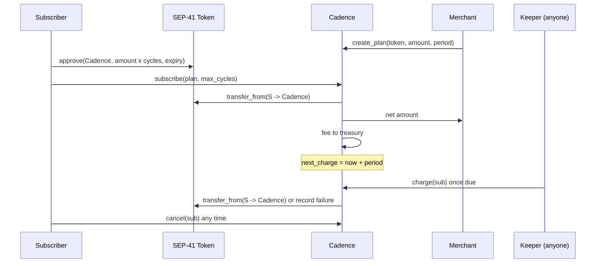

# Cadence

**Non-custodial recurring payments for Stellar.** Subscribers approve a bounded
spending limit, anyone can trigger a charge when a cycle is due, and the
subscriber can cancel or revoke at any time. Funds never rest in the contract.

Built with Rust + Soroban, a Next.js + TypeScript frontend, and Stellar Wallets Kit
(Freighter, xBull, LOBSTR, Albedo, Hana and more).

## Why this matters for Stellar

Stellar is built for payments and stablecoins, but there is no native way to bill
someone repeatedly. Every app that wants subscriptions, salaries-on-demand, SaaS
billing, memberships, rent or installments has to either hold user funds
(custodial risk) or ask the user to sign every payment (poor UX).

Soroban's SEP-41 `approve` / `transfer_from` allowance primitive makes a third
way possible: **pull payments with a hard cap**. Cadence turns that primitive
into a reusable, audited-by-design building block:

| Problem today | With Cadence |
| --- | --- |
| Custodial billing escrow | The contract holds a zero balance between calls |
| Sign every renewal | One approval, then automatic charges |
| Unbounded "allow forever" risk | Allowance is capped and expires; cancel at any time |
| Each app re-implements billing | One shared contract, any SEP-41 token, any front end |
| Merchants in emerging markets lack card rails | USDC/XLM subscriptions with ~5 second finality |

It is deliberately small (about 450 lines of contract code), composable (other
contracts can read plans and subscriptions), and permissionless for keepers.

## How it works



Key behaviours (all covered by tests):

* **First cycle is atomic.** `subscribe` reverts if the first payment fails, so a
  subscription never exists without a paid first cycle.
* **No catch-up billing.** If a keeper is late by more than a period, the schedule
  restarts from now. Subscribers are never charged for cycles that were skipped.
* **Failures are recorded, not fatal.** Missing allowance or balance records a
  failure with a 6 hour retry cooldown; 3 consecutive failures auto-cancel.
* **Cancel always works**, even when the protocol is paused.
* **Fee is capped at 5%** in code; the admin can lower it but never exceed it.

## Repository layout

```
cadence/
├── Cargo.toml                    workspace, release profile tuned for WASM size
├── contracts/cadence/
│   ├── src/lib.rs                contract entry points + business logic
│   ├── src/types.rs              Plan, Subscription, Config, DataKey
│   ├── src/storage.rs            TTL-aware storage helpers + paginated indexes
│   ├── src/events.rs             typed #[contractevent] structs
│   ├── src/errors.rs             stable error codes
│   ├── src/test.rs               unit tests
│   └── tests/lifecycle.rs        6-month multi-party integration test
├── frontend/                     Next.js (App Router) + TypeScript
│   ├── lib/cadence.ts            typed contract client (simulate -> sign -> submit)
│   ├── lib/wallet.ts             Stellar Wallets Kit adapter (single file)
│   └── components/               Subscribe / My subscriptions / Sell panels
├── scripts/                      build, deploy-testnet, smoke-test
├── docs/                         ARCHITECTURE, SECURITY, GOOD_FIRST_ISSUES
└── .github/workflows/ci.yml      fmt, clippy, tests, wasm build, frontend build
```

## Quick start

Prerequisites: Rust (stable) with the `wasm32v1-none` target,
[Stellar CLI](https://developers.stellar.org/docs/tools/cli), Node 22+, `jq`.

```bash
# 1. Contract
cargo test --all                  # unit + integration tests
./scripts/build.sh                # -> target/wasm32v1-none/release/cadence.wasm

# 2. Deploy to Testnet (creates + funds an identity, writes frontend/.env.local)
./scripts/deploy-testnet.sh
./scripts/smoke-test.sh           # create plan -> approve -> subscribe -> cancel

# 3. Frontend
cd frontend
npm install                       # .npmrc points @jsr at https://npm.jsr.io
npm run dev                       # http://localhost:3000
```

Install a wallet (for example [Freighter](https://freighter.app)), switch it to
**Testnet**, fund the account with Friendbot, then:

1. **Sell** tab: create a plan (the demo token is Testnet native XLM).
2. Copy the share link (`/?plan=1`) into a second wallet/account.
3. **Subscribe** tab: approve an allowance, then subscribe.
4. **My subscriptions** tab: watch the cycle strip; when due, press *Run due payment*.

## Contract interface

| Function | Who | What |
| --- | --- | --- |
| `__constructor(admin, fee_recipient, fee_bps)` | deployer | atomic init at deploy time |
| `create_plan(merchant, token, amount, period, name)` | merchant | publish a plan, returns id |
| `set_plan_active(plan_id, active)` | merchant | open/close to new subscribers |
| `subscribe(subscriber, plan_id, max_cycles)` | subscriber | pay cycle 1, start schedule |
| `charge(sub_id)` | **anyone** | execute one due cycle |
| `cancel(caller, sub_id)` | subscriber or merchant | stop future charges |
| `bump_subscription(sub_id)` | anyone | extend TTL for long-period plans |
| `get_plan`, `get_subscription`, `plans_of`, `subscriptions_of`, `is_due`, `get_config` | view | reads, paginated (max 50) |
| `set_fee`, `set_fee_recipient`, `set_paused`, `propose_admin`, `accept_admin`, `upgrade` | admin | governance |

Error codes are stable and listed in `contracts/cadence/src/errors.rs`.

## Integrating from another contract or app

Read plans and subscriptions with the generated client, or generate TypeScript
bindings after deploying:

```bash
stellar contract bindings typescript --network testnet \
  --contract-id $(jq -r .contractId deployments/testnet.json) \
  --output-dir bindings/cadence
```

## Security

See [docs/SECURITY.md](docs/SECURITY.md) for the threat model. Summary: no custody,
checked arithmetic, all privileged calls behind `require_auth`, hard fee cap,
atomic constructor, two-step admin handover, per-call auth on every user action,
pause that never traps user exits. **This code has not been independently
audited. Do not deploy to Mainnet with real funds before an audit.**

## Contributing

See [docs/GOOD_FIRST_ISSUES.md](docs/GOOD_FIRST_ISSUES.md) for scoped starter tasks
(bug fixes, features, docs, testing). Run `cargo fmt`, `cargo clippy` and
`cargo test` before opening a PR.

## Changelog

### [Unreleased] — audit pass (October 2026)

**Contract**
* `bump_subscription` now also calls `bump_sub_index`, extending TTL on all of
  the subscriber's per-user index entries. This fixes the simulation-vs-commit
  gap: simulated frontend reads do not commit TTL changes, so keepers calling
  `bump_subscription` alongside `charge` is now the reliable on-chain path to
  keep indexes alive.
* `read_index` in `storage.rs` bumps TTL on count and item keys it reads, so
  any on-chain call that traverses the index (including through write paths) also
  extends it.
* Added `bump_sub_index` helper in `storage.rs`.
* Added double-execution safety comment to `charge()` explaining why competing
  keeper transactions cannot double-bill within a single ledger.

**Tests** (28 total — +3 from previous)
* `create_plan_validates_input` — extended with `amount = -1` rejection case.
* `subscribe_without_subscriber_auth_reverts` — new: calls `set_auths(&[])` to
  disable mock auth and asserts `subscribe` reverts without a valid authorisation.
* `charge_failure_leaves_subscriber_balance_and_failures_unchanged` — new:
  asserts subscriber balance is unchanged and `failures` increments (not
  `next_charge`) when `transfer_from` fails.
* `bump_subscription_is_permissionless` — extended: asserts subscriber index is
  intact after `bump_subscription`, covering the `bump_sub_index` path.

**Frontend**
* `lib/wallet.ts`: replaced `defaultModules()` with an explicit module list
  excluding `MetaMaskModule`. `@metamask/connect-stellar@0.3.x` contains a broken
  import of the old `@creit.tech/stellar-wallets-kit` scope that caused
  `next build` to fail. Wallets supported: Freighter, LOBSTR, Albedo, Hana,
  xBull, Rabet.

**CI**
* Stellar CLI version pinned to `28.1.0` in `ci.yml` for reproducible builds.

**Integration test** (`tests/lifecycle.rs`)
* Fixed Clippy errors: `1_000_0000000` → `10_000_000_000`,
  `5_0000000` → `50_000_000`, `1_0000000` → `10_000_000`
  (digit grouping); collapsed nested `if` (collapsible-if).

**Docs**
* `docs/SECURITY.md`: added simulation-vs-commit TTL clarification; documented
  that `max_cycles` and allowance limits are enforced on-chain; added fee rounding
  direction; added deactivated-plan behaviour note.
* `docs/ARCHITECTURE.md`: clarified that simulated reads do not commit TTL
  extensions; documented `bump_subscription` as the keeper-friendly TTL path.

## License

MIT
